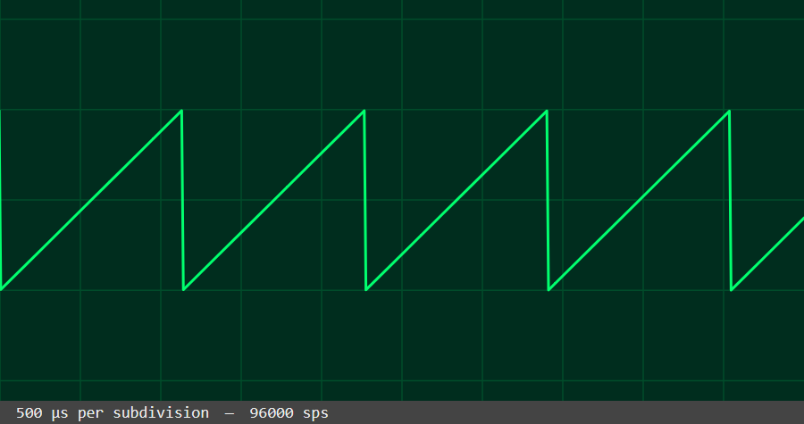
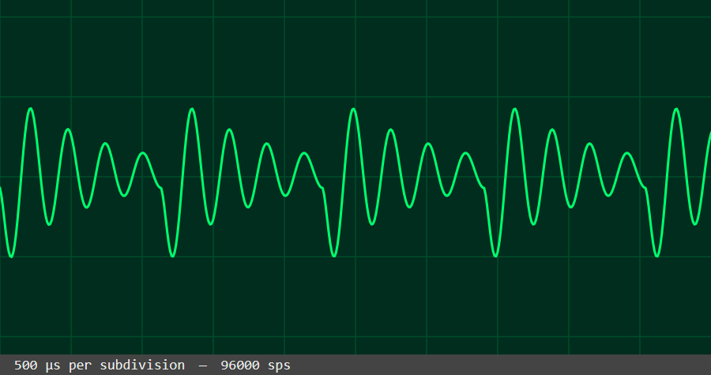
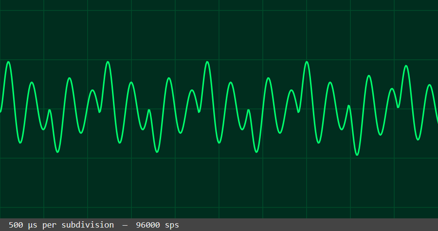

# Those GSM ringtones

If you were alive in 2000, you probably remember the sound of monophone ringtones.
If you took a bus to middle school in 2000 you _definitely_ remember that sound.
Would there be some soundfont around that mimicks this sound?

There is [Nokia Composer](https://zserge.com/nokia-composer/#eyJicG0iOiIxMjAiLCJzb25nIjoiMTZlMiAxNmQyIDgjZiA4I2cgMTYjYzIgMTZiIDhkIDhlIDE2YiAxNmEgOCNjIDhlIDJhIDItIn0=)
[by *zserge*](https://github.com/zserge/nokia-composer/), and while the website
has one of those unmistakable GSM fonts, it doesn’t *sound* like a mobile phone.
You may recognise the sound from something else — it is similar to music from the good
ol’ PC speaker from the 1980’s, but it does not sound like a phone.

## The waveform

First question is, what type of waveform is it?

[r/audioengineering](https://www.reddit.com/r/audioengineering/comments/mioflo/how_would_i_make_something_that_sounds_like_an/) on Reddit had the answer:
It is *a simple sawtooth wave*…

 
*Saw wave. This sounds **not at all** like a GSM.*

…but with strong filtering: the character of that sound is created by the speaker 
itself: it has a strong resonance around a couple of thousands of hertz, so that the
tiny speaker in these phones can create enough volume to hear the ringtone.

 
*Saw wave after applying the filters*

Most of the sound here is the resonance of the speaker: You can see it decaying
between the drops of the original sawtooth wave. A tiny speaker like that can’t
produce low frequencies, so most of what you get are overtones.

## The soundfont

If you make a soundfont with this sort of sound, you’ll need a sample for every note.
This is because shifting a sample up or down will also shift up this resonance peak,
which will very quicky make it sound _wrong_.

(This is also why voices on synthesizer keyboards are so unmistakably _synthesizer_. The
thing you subconsciously notice is the [_formants_](https://en.wikipedia.org/wiki/Formant)
being shifted up and down, something that does not happen if a singer sings another note.)

This contrasts with instruments like bells. Carillon bells are tuned to have very
specific overtones relative to the pitch, so you could make a decent sounding soundfont
_with a single sample_.

## That PC beeper

So since we’re into old school sounds, what about that [PC speaker](https://en.wikipedia.org/wiki/PC_speaker)?

These use 50% duty cycle square waves. Even this simple waveform already sounds like an old PC. But
as with our phone ringtone, it is also shaped by the small speakers inside the typical 1980’s and 1990’s PC cases. So there isn’t actually _one_ PC speaker sound. Originally, a small _dynamic speaker_ was used,
a small version of the ones you still find in speakers today. Later, when Sound Blasters
and other sound cards became ubitiquous, nothing really used the PC speaker anymore and you got
those tiny moving-iron speakers. It is easy to tell apart those two, with the latter producing a
very tinny and resonant sound.

So there’s two variants of the PC speaker. Both start with a square wave but
one has a much more narrow band filter to produce the ‘tiny speaker’ sound.

 
*Square wave, after filtering. The filtering is quite similar to that for the GSM tone.*

Even though that filtering, it _very clearly_ is not a GSM. A 50% square wave only produces
odd overtones (1, 3, 5…) which gives it a characteristic and easy to recognise hollow sound.
